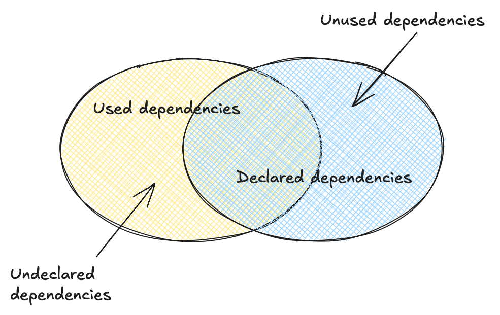

[](https://pypi.org/project/fawltydeps/) [](https://pypi.org/project/fawltydeps/)  [](https://pypi.org/project/fawltydeps/) [](code_of_conduct.md) [](https://discord.gg/V2d9xpgD4D)

# FawltyDeps

FawltyDeps is a dependency checker for Python that finds _undeclared_ and/or
_unused_ 3rd-party dependencies in your Python project.
The name is inspired by the Monty Python-adjacent
[Fawlty Towers](https://en.wikipedia.org/wiki/Fawlty_Towers) sitcom.

📝 Full documentation available at: [tweag.github.io/FawltyDeps](https://tweag.github.io/FawltyDeps/)


We [invite you](https://discord.gg/V2d9xpgD4D) to join our [Discord channel](https://discord.com/channels/1174731094726295632/1176462512212951090)! It's a great place to ask questions, share your ideas, and collaborate with other contributors.


## Key Concepts

- **_undeclared_ dependency**: a package that's used (in particular, `import`ed) by a project and which lacks a corresponding declaration to ensure that it's available.
  For example, you `import numpy`, but you've forgotten to include `numpy` in your `requirements.txt`.
  Pragmatically, this means the project is prone to runtime errors.
- **_unused_ dependency**: a package that's declared as necessary for a project but which is never used by project code.
  For example, you have `numpy` listed in your `requirements.txt`, but you never actually `import numpy`.
  Pragmatically, this means that project installation may consume more space than needed and will be more likely to break with future software releases; in short, these are costs paid for no benefit.

Your project dependencies may look like this:


<p align="center">
  
</p>

But FawltyDeps is all about helping you get to this perfect green spot:

<p align="center">
  
</p>

## Installation

The library is distributed with PyPI, so simply:

```sh
pip install fawltydeps
```

or any other way to install Python packages from PyPI should be enough to make it available in your environment.

Consider adding `fawltydeps` to your development dependencies, to help you catch undeclared and unused dependencies in your projects.

## Usage

To check the project in the current directory run:

```sh
fawltydeps
```

This will find imports in all the Python code under the current directory,
extract dependencies declared by your project, and then report
[_undeclared_ and _unused_ dependencies](#key-concepts).


## Development

For details on setting up your development environment, please refer to the
contributing guidelines of how to [set up your development environment](./docs/CONTRIBUTING.md#set-up-your-development-environment)
in our [CONTRIBUTING.md](./docs/CONTRIBUTING.md) file.
