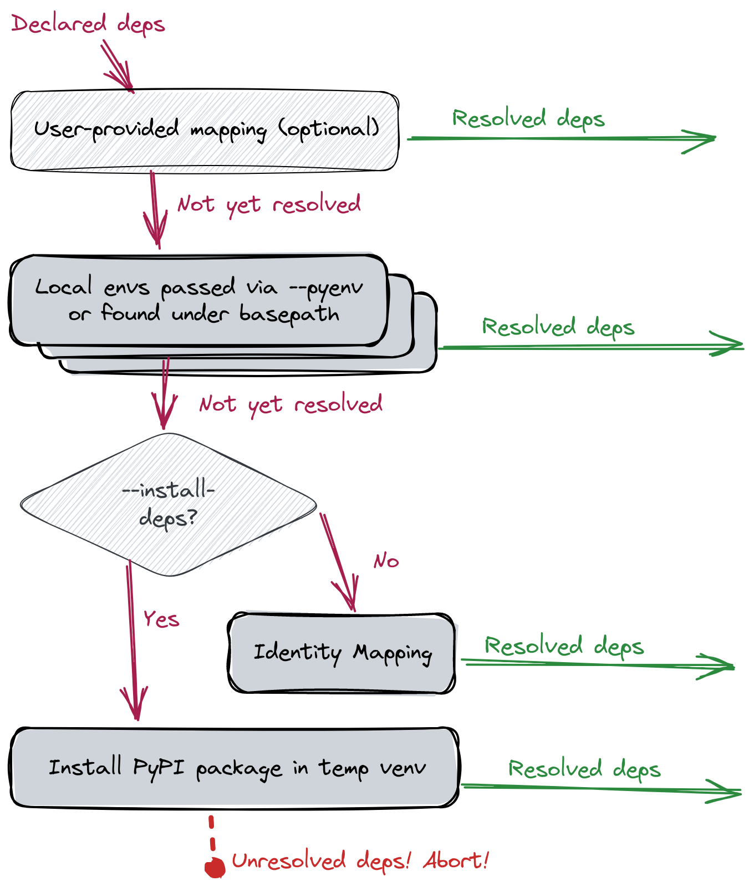

[](https://pypi.org/project/fawltydeps/) [](https://pypi.org/project/fawltydeps/)  [](https://pypi.org/project/fawltydeps/) [](code_of_conduct.md)

# FawltyDeps

FawltyDeps is a dependency checker for Python that finds _undeclared_ and/or
_unused_ 3rd-party dependencies in your Python project.
The name is inspired by the Monty Python-adjacent
[Fawlty Towers](https://en.wikipedia.org/wiki/Fawlty_Towers) sitcom.


## Table of contents

[Key Concepts](#key-concepts)

[Installation](#installation)

[Usage](#usage)

[Configuration](#configuration)

[Documentation](#documentation)

[Development](#development)

[Integration tests](#integration-tests)

[FAQ](#faq)

## Key Concepts

- **_undeclared_ dependency**: a package that's used (in particular, `import`ed) by a project and which lacks a corresponding declaration to ensure that it's available.
  For example, you `import numpy`, but you've forgotten to include `numpy` in your `requirements.txt`.
  Pragmatically, this means the project is prone to runtime errors.
- **_unused_ dependency**: a package that's declared as necessary for a project but which is never used by project code.
  For example, you have `numpy` listed in your `requirements.txt`, but you never actually `import numpy`.
  Pragmatically, this means that project installation may consume more space than needed and will be more likely to break with future software releases; in short, these are costs paid for no benefit.

## Installation

The library is distributed with PyPI, so simply:

```sh
pip install fawltydeps
```

or any other way to install Python packages from PyPI should be enough to make it available in your environment.

Consider adding `fawltydeps` to your development dependencies, to help you catch undeclared and unused dependencies in your projects.

## Usage

To check the project in the current directory run:

```sh
fawltydeps
```

This will find imports in all the Python code under the current directory,
extract dependencies declared by your project, and then report
[_undeclared_ and _unused_ dependencies](#key-concepts).

### Available Actions

FawltyDeps provides the following options for controlling what actions to perform. Only
one of these can be used at a time:

- `--check`: Report both undeclared and unused dependencies
- `--check-undeclared`: Report only undeclared dependencies
- `--check-unused`: Report only unused dependencies
- `--list-imports`: List third-party imports extracted from the project
- `--list-deps`: List declared dependencies extracted from the project
- `--list-sources`: List files/directories from which imports, declared
  dependencies and installed packages would be extracted

When none of these are specified, the default action is `--check`.

### Where to find code and dependency declarations

By default, FawltyDeps will look for Python code (`*.py` and `*.ipynb`) and
dependency declarations (see list of supported files below) under the current
directory. If you want FawltyDeps to look elsewhere, you can pass a different
directory (aka `basepath`) as a positional argument:

```sh
fawltydeps my_project/
```

If you want to separately declare the source of the code and the source of the
dependencies, you may use the `--code` and `--deps` options documented in the
next section. In short, giving the `basepath` positional argument is equivalent
to passing both the `--code` and the `--deps` options, like this:

```sh
fawltydeps --code my_project/ --deps my_project/
```

#### Where to find Python code

The `--code` option tells FawltyDeps where to find the Python code to parse for
`import` statements. You can pass any number of these:

- a single file: Either a Python file (`*.py`) or a Jupyter Notebook (`*.ipynb`)
- a directory: FawltyDeps will find all Python files and Jupyter notebooks under this directory.
- `-`: Passing a single dash (`--code=-`) tells FawltyDeps to read Python code
  from stdin.

If no `--code` option is passed, FawltyDeps will find all Python code under the
`basepath`, if given, or the current directory (i.e. same as `--code=.`).
To include both code from stdin (`import foo`) and a file path (`file.py`), use:

```sh
echo "import foo" | fawltydeps --list-imports --code - file.py
```

At any time, if you want to see where FawltyDeps is looking for Python code,
you can use the `--list-sources --detailed` options.

#### Where to find declared dependencies

The `--deps` option tells FawltyDeps where to look for your project's declared
dependencies. A number of file formats are supported:

- `*requirements*.txt` and `*requirements*.in`
- `pyproject.toml` (following PEP 621 or Poetry conventions)
- `setup.py` (only limited support for simple files with a single `setup()`
  call and no computation involved for setting the `install_requires` and
  `extras_require` arguments)
- `setup.cfg`

The `--deps` option accepts a space-separated list of files or directories.
Each file will be parsed for declared dependencies; each directory will
be searched, parsing all of the supported files (see the above list) found
within. You would typically want to pass individual files, if you want to
be explicit about where to find the declared dependencies.

If no `--deps` option is passed, FawltyDeps will look for the above files under
the `basepath`, if given, or the current directory (i.e. same as `--deps .`).

### Resolving dependencies

When FawltyDeps looks for undeclared and unused dependencies, it needs to match
`import` statements in your code with corresponding package dependencies
declared in your project configuration.

To solve this, FawltyDeps uses a sequence of resolvers (aka. mapping strategies)
to determine which Python packages provide which import names. The diagram below
shows the dependencies' flow through the sequence of mappings supported by
FawltyDeps (each of which is introduced in the following subsections):
- Local Python environment mapping
- Mapping via temporarily installed packages
- Identity mapping
- User-defined mapping




The priority of each of these mappings, together with their default values and
customization options are summarized in the table below:

| Priority | Mapping strategy        | Options |
|----------|----------------------|------------|
| 1        | User-defined mapping | Provide a custom mapping in TOML format via `--custom-mapping-file` or a `[tool.fawltydeps.custom_mapping]` section in `pyproject.toml`. <br /> Default: No custom mapping|
| 2        | Mapping from installed packages | Point to one or more environments via `--pyenv`.<br />Default: auto-discovery of Python environments under the project’s basepath. If none are found, default to the Python environment in which FawltyDeps itself is installed.|
| 3a       | Mapping via temporary installation of packages  | Activated with the `--install-deps` option.|
| 3b       | Identity mapping | Active by default. Deactivated when `--install-deps` is used. |


#### Local Python environment mapping

Local Python environment mapping refers to using packages already installed
in local Python environments on your system to resolve dependencies into
the imports they expose. This leverages the functionality provided
by the excellent [`importlib_metadata`](https://importlib-metadata.readthedocs.io/en/latest/)
library.

You can use the `--pyenv` option (or the `pyenvs` configuration directive)
to point FawltyDeps at one [or more] specific Python environment(s) located
within your project or elsewhere. For example:

```sh
fawltydeps --code my_package/ --deps pyproject.toml --pyenv /path/to/project/venv
```

This will tell FawltyDeps:

- to look for `import` statements in the `my_package/` directory,
- to parse dependencies from `pyprojects.toml`, and
- to use the Python environment at `/path/to/project/venv` to map dependency names in
  `pyproject.toml` into import names used in your code under `my_package/`

If `--pyenv` is not used, FawltyDeps will look for _Python environments_
(virtualenvs or similar directories like `.venv` or `__pypackages__`.) inside
your project (i.e. under `basepath`, if given, or the current directory).

If no Python environments are found within your project, FawltyDeps will fall
back to looking at your _current Python environment_: This is the environment
in which FawltyDeps itself is installed.

This works well when you, for example, `pip install fawltydeps` into the same
virtualenv as your project dependencies.

You can use `--pyenv` multiple times to have FawltyDeps look for packages in
multiple Python environments. In this case (or when multiple Python environments
are found inside your project) FawltyDeps will use the union (superset) of all
imports provided by all matching packages across those Python environments as
valid import names for that dependency.

#### Identity mapping

When unable to find an installed package that corresponds to a declared
dependency either via a user-provided mapping or local Python environments,
FawltyDeps will fall back to one of two strategies. "Identity mapping", which we
present in this section is the default fallback strategy. We discuss the other
strategy in the next subsection.

Identity mapping relies on the simplistic assumption that the dependency provides
a single import of the same name, i.e. it will expect that when you depend on
`some_package`, then that should correspond to `import some_package` statements
in your code.

This assumption is correct for many packages and it allows FawltyDeps to
produce results (albeit sometimes inaccurate ones) when the current Python
environment does not contain all of your declared dependencies.

To ensure correctness, however, refer to the next subsection outlining the other
fallback strategy.

#### Mapping by temporarily installing packages

Your local Python environements might not always have all your project's
dependencies installed. Assuming that you don’t want to go through the
bother of installing packages manually, and you also don't want to rely on
the inaccurate identity mapping as your fallback strategy, you can use the
`--install-deps` option. This will `pip install`
missing dependencies (from [PyPI](https://pypi.org/), by default) into a
_temporary virtualenv_, and allow FawltyDeps to use this to come up with the
correct mapping.

Since this is a potentially expensive strategy (e.g. downloading packages from
PyPI), we have chosen to hide it behind the `--install-deps` command-line
option. If you want to always enable this option, you can set the corresponding
`install_deps` configuration variable to `true` in the `[tool.fawltydeps]`
section of your `pyproject.toml`.

To customize how this auto-installation happens (e.g. use a different package index),
you can use [pip’s environment variables](https://pip.pypa.io/en/stable/topics/configuration/).

Note that we’re never guaranteed to be able to resolve _all_ dependencies with
this method: For example, there could be a typo in your `requirements.txt` that
means a dependency will _never_ be found on PyPI, or there could be other
circumstances (e.g. network issues or restrictions in your CI environment) that
prevent this strategy from working at all.
In this case, FawltyDeps will throw an error and abort.

#### User-defined mapping

We provide a custom mapping functionality to users wishing to take control
over the way FawltyDeps resolves dependencies. You may define your own mapping
of dependency names to import names, by providing a TOML file like this:

```toml
my-package = ["mpkg"]
scikit-learn = ["sklearn"]
multiple-modules = ["module1", "module2"]
```

To use your mapping, run:

```sh
fawltydeps --custom-mapping-file my_mapping.toml
```

FawltyDeps will parse your `my_mapping.toml` file and use the extracted mapping
for matching dependencies to imports.

You may also place the custom mapping in the `pyproject.toml` file of your
project, inside a `[tool.fawltydeps.custom_mapping]` section, like this:

```toml
[tool.fawltydeps.custom_mapping]
my-package = ["mpkg"]
scikit-learn = ["sklearn"]
multiple-modules = ["module1", "module2"]
```

The provided mapping can be complete or partial. When a dependency is not
present in the given mapping, FawltyDeps will continue to resolve it using
the sequence of resolvers illustrated in the diagram above.

Caution when using your mapping is advised: As illustrated in the diagram, the
user-defined mapping takes precedence over the other resolvers documented
above. For example, if the mapping file has some stale/incorrect mapping
entries, they will _not_ be resolved by the Python environment resolver (which
is usually more accurate).

### Ignoring irrelevant results

There may be `import` statements in your code that should not be considered an
undeclared dependency. This might happen if you for example do a conditional
`import` with a `try: ... except ImportError: ...` block (or similar).
FawltyDeps is not able to recognize whether these dependencies should have been
declared or not, but you can ask for them to be ignored with the
`--ignore-undeclared` option, for example:
`--ignore-undeclared some_module some_other_module`

Conversely, there may be dependencies that you have declared without intending
to `import` them. This is often the case for developer tools like Black or Mypy
that are part of your project's development environment.
We've introduced a `DEFAULT_IGNORE_UNUSED` list, which includes various
categories of commonly used development tools and dependencies.
FawltyDeps can automatically ignore these dependencies when checking for unused
imports. For the complete list, please see the `DEFAULT_IGNORE_UNUSED`
variable in the [`fawltydeps/settings.py`](./fawltydeps/settings.py) file
in the repository. If you have additional dependencies that you want to exclude
from the check for unused imports, you can use the `--ignore-unused` option
to customize the ignore list. By providing your own list of dependencies with
this option, you can effectively overwrite the default list. For example:
`--ignore-unused black mypy some_other_module`

### Output formats

The default output from FawltyDeps is a summary outlining the relevant
dependencies found (according to the selected actions).
However you can also ask for more information from FawltyDeps:

- `--summary`: Default (human-readable) summary output
- `--detailed`: Longer (human-readable) output that includes the location of
  the relevant dependencies.
- `--json`: Verbose JSON-formatted output for other tools to consume and
  process further.

Only one of these options can be used at a time.

### More help

Run `fawltydeps --help` to get the full list of available options.

## Configuration

You can use a `[tool.fawltydeps]` section in `pyproject.toml` to configure the
default behavior of FawltyDeps. Here's a fairly comprehensive example:

```toml
[tool.fawltydeps]
code = ["myproject"]  # Only search for imports under ./myproject
deps = ["pyproject.toml"]  # Only look for declared dependencies here
ignore_unused = ["black"]  # We use `black`, but we don't intend to import it
output_format = "human_detailed"  # Detailed report by default
```

Here is a complete list of configuration directives we support:

- `actions`: A list of one or more of these actions to perform: `list_imports`,
  `list_deps`, `check_undeclared`, `check_unused`. The default behavior
  corresponds to `actions = ["check_undeclared", "check_unused"]`.
- `output_format`: Which output format to use by default. One of `human_summary`,
  `human_detailed`, or `json`.
  The default corresponds to `output_format = "human_summary"`.
- `code`: Files or directories containing the code to parse for import statements.
  Defaults to the current directory, i.e. like `code = ["."]`.
- `deps`: Files or directories containing the declared dependencies.
  Defaults to the current directory, i.e. like `deps = ["."]`.
- `pyenvs`: Where to look for Python environments (directories like `.venv`,
  `__pypackages__`, or similar) to be used for resolving project dependencies
  into provided import names. Defaults to looking for Python environments under
  the current directory, i.e. like `pyenvs = ["."]`. If none are found, use the
  Python environment where FawltyDeps is installed (aka. `sys.path`).
- `ignore_undeclared`: A list of specific dependencies to ignore when reporting
  undeclared dependencies, for example: `["some_module", "some_other_module"]`.
  The default is the empty list: `ignore_undeclared = []`.
- `ignore_unused`: A list of specific dependencies to ignore when reporting
  unused dependencies, for example: `["black", "mypy", "some_other_module"]`.
  The default is a list including common development tools. However, you have the
  flexibility to overwrite this list according to your project's specific requirements.
  For the complete default list, please see the `DEFAULT_IGNORE_UNUSED`
  variable in the [`fawltydeps/settings.py`](./fawltydeps/settings.py) file
  in the repository.
- `deps_parser_choice`: Manually select which format to use for parsing
  declared dependencies. Must be one of `"requirements.txt"`, `"setup.py"`,
  `"setup.cfg"`, `"pyproject.toml"`, or leave it unset (i.e. the default) for
  auto-detection (based on filename).
- `install-deps`: Automatically install Python dependencies gathered with
  FawltyDeps into a temporary virtual environment. This will use `pip install`,
  which downloads packages from PyPI by default.
- `verbosity`: An integer controlling the default log level of FawltyDeps:
  - `-2`: Only `CRITICAL`-level log messages are shown.
  - `-1`: `ERROR`-level log messages and above are shown.
  - `0`: `WARNING`-level log messages and above are shown. This is the default.
  - `1`: `INFO`-level log messages and above are shown.
  - `2`: All log messages (including `DEBUG`) are shown.
- `custom_mapping_file`: Paths to files containing user-defined mapping.
  Expected file format is defined in the User-defined mapping [section](#user-defined-mapping).
- `[tool.fawltydeps.custom_mapping]`: Section in the configuration, under which a custom mapping
  can be added. Expected format is described in the User-defined mapping [section](#user-defined-mapping).

### Environment variables

In addition to configuring FawltyDeps via `pyproject.toml` as show above, you
may also pass the above configuration directives via the environment, using a
`fawltydeps_` prefix. For example, to enable JSON output via the environment,
set `fawltydeps_output_format=json` in FawltyDeps' environment.

### Configuration cascade

- Command-line options take precedence, and override corresponding settings
  passed via the environment or `pyproject.toml`.
- Environment variables override corresponding settings from `pyproject.toml`.
- Configuration in `pyproject.toml` override only the ultimate hardcoded defaults.
- The ultimate defaults when no cutomizations takes place are hardcoded inside
  FawltyDeps, and are documented above.

## Documentation

This project began with an exploration and design phase, yielding this [design document](./docs/DesignDoc.md), which lays out the main objective for this project and compares various strategies considered

In the [code design](./docs/CodeDesign.md) section of documentation we lay out rules which we adopt to guide code architecture decisions and maintain code quality as the project evolves.

## Development

For details on setting up your development environment, please refer to the
contributing guidelines of how to [set up your development environment](./CONTRIBUTING.md#set-up-your-development-environment)
in our [CONTRIBUTING.md](CONTRIBUTING.md) file.

## Integration tests

For details on integration tests, please refer to the
[Testing section](./CONTRIBUTING.md#testing) in our [CONTRIBUTING.md](./CONTRIBUTING.md) file.

## FAQ

### I run `fawltydeps` and get some undeclared dependencies. What can I do with it?

You can run a detailed report to see the exact location (file and line number), in which
the undeclared dependencies were imported:

```sh
fawltydeps --detailed
```

and debug each occurrence. Typically an undeclared dependency can be fixed in a couple of ways:

- A true undeclared dependency is fixed by _declaring_ it, e.g. adding it to your `pyproject.toml` or similar.
- If you disagree with FawltyDeps' classification, you can always use `--ignore-undeclared` to silence the error. If you're sure this dependency should not have been reported by FawltyDeps, you may consider filing a bug report.

### How not to display tools like `black` and `pylint` in _unused dependencies_?

By default, all packages declared as dependencies by your project are included
in the FawltyDeps analysis, even if they only contain tools that were not meant
to be `import`ed, but rather meant to be run by, say, in a pre-commit hook or a
CI script. In such cases you may use either:

```sh
fawltydeps --ignore-unused black pylint
```

or add an equivalent directive to the FawltyDeps configuration in your
`pyproject.toml` (see below).

### How can I store my `fawltydeps` command line options in a configuration file?

You can run:

```sh
fawltydeps --generate-toml-config
```

to generate a `[tool.fawltydeps]` section with the current configuration that
you can then directly copy into your `pyproject.toml`. Options that have their
default value are commented in this output, so you have quickly see where your
settings differ from the FawltyDeps defaults.

This also works together with other command line options, so for example in the
previous question, you could add `--generate-toml-config` to the command line
(i.e. run `fawltydeps --ignore-unused black pylint --generate-toml-config`),
to get this:

```toml
[tool.fawltydeps]
# Default options are commented...
ignore_unused = ["black", "pylint"]
```

### How to use FawltyDeps in a monorepo?

Running `fawltydeps` without arguments at the root of a monorepo
will most likely not give you a useful result:
it will collect dependencies and import statements from across the _entire_ monorepo.
The produced report may be overwhelming and at the same time not granular enough.

Instead, you should run FawltyDeps for each package separately.
This collects dependencies and import statements for one package at a time.

Having:

```sh
├ lib1
| ├ pyproject.toml
| ├ ....
├ lib2
| ├ pyproject.toml
| ├ ....
```

run for each `libX`:

```sh
fawltydeps libX
```

### Why must FawltyDeps run in the same Python environment as my project dependencies?

(This is no longer true since FawltyDeps v0.11: FawltyDeps should be able to
automatically find your project dependencies when they are installed in a Python
environment that exists within your project. If your project dependencies are
installed elsewhere, you can point FawltyDeps in their direction with `--pyenv`,
as explained above in the section on
[Python environment mapping](#python-environment-mapping))

The reason why FawltyDeps need to find your project dependencies _somewhere_ is
that the core logic of FawltyDeps needs to match `import` statements in your
code with dependencies declared in your project configuration. This seems
straightforward for many packages: for example you `pip install requests` and
then you can `import requests` in your code. However, this mapping from the name
you install to the name you `import` is not always self-evident:

- There are sometimes differences between the package name that you
  declare as a dependency, and the `import` name it provides. For example, you
  depend on `PyYAML`, but you `import yaml`.
- A dependency can expose more than one import name. For example the
  `setuptools` package exposes three `import`able packages: `_distutils_hack`,
  `pkg_resources`, and `setuptools`. So when you `import pkg_resources`,
  FawltyDeps need to figure out that this corresponds to the `setuptools`
  dependency.

To solve this, FawltyDeps looks at the packages installed in your Python
environment to correctly map dependencies (package names) into the imports that
they provide. This is:

- any Python environment found via the `--pyenv` option, or
- any Python environment found within your project (`basepath` or the current
  directory).
- Failing that, FawltyDeps will use the _current Python environment_,
  i.e. the one in which FawltyDeps itself is running.

As a final resort, when an installed package is not found for a declared
dependency, the
_identity mapping_ that FawltyDeps falls back to will still do a good job for
the majority of dependencies where the import name is indeed identical to the
package name that you depend on.

This is an area of active development in FawltyDeps, and we are
[working on better solutions](https://github.com/tweag/FawltyDeps/issues/195),
to avoid having to fall back to this identity mapping.

### Why does FawltyDeps fail to match `sklearn` with `scikit-learn`?

There are cases, where FawltyDeps may not match imports and obviously related
dependencies, like `sklearn` and `scikit-learn`. It will report `sklearn` as
_undeclared_ and `scikit-learn` as an _unused_ dependency.

This is very much related to the above question. `scikit-learn` is an example
of a package that exposes a different import name: `sklearn`.
When `scikit-learn` is not found in the Python environment(s) used by FawltyDeps,
then FawltyDeps is unable to make the connection between these two names.

To solve this problem, make sure that `scikit-learn` is installed in a Python
environment that belongs to your project. Alternatively, you can use the
`--pyenv` option to point at a Python environment where `scikit-learn` and your
other dependencies are installed.

### How can I pass Python code to FawltyDeps via standard input?

The `--code` argument accepts a single hyphen (`-`) as a special value meaning
that code should be read from standard input. When using this you may pipe or
redirect your Python code into FawltyDeps like this:

```sh
cat some/source/of/python/code | fawltydeps --code -
# or
fawltydeps --code - < some/source/of/python/code
```

You can also use this directly in the terminal to e.g. have FawltyDeps analyze
some Python code that is in your clipboard:

```sh
fawltydeps --code -
# FawltyDeps waits for code on stdin; paste from your clipboard,
# then press Ctrl+D to signal EOF (end-of-file).
```

### Can I use FawltyDeps as a pre-commit hook?

Yes! Assuming that you already use the [pre-commit](https://pre-commit.com)
tool, you can add something like this to your project's
`.pre-commit-config.yaml`:

```yaml
repos:
  - repo: https://github.com/tweag/FawltyDeps
    rev: v0.13.1
    hooks:
      - id: check
        args:
          - --detailed
```
