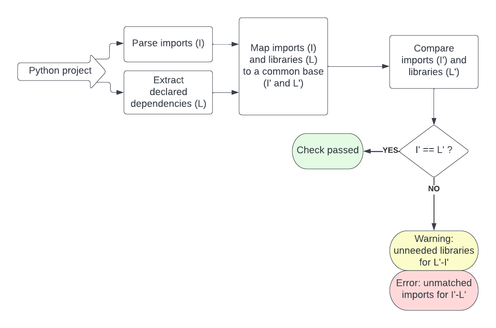
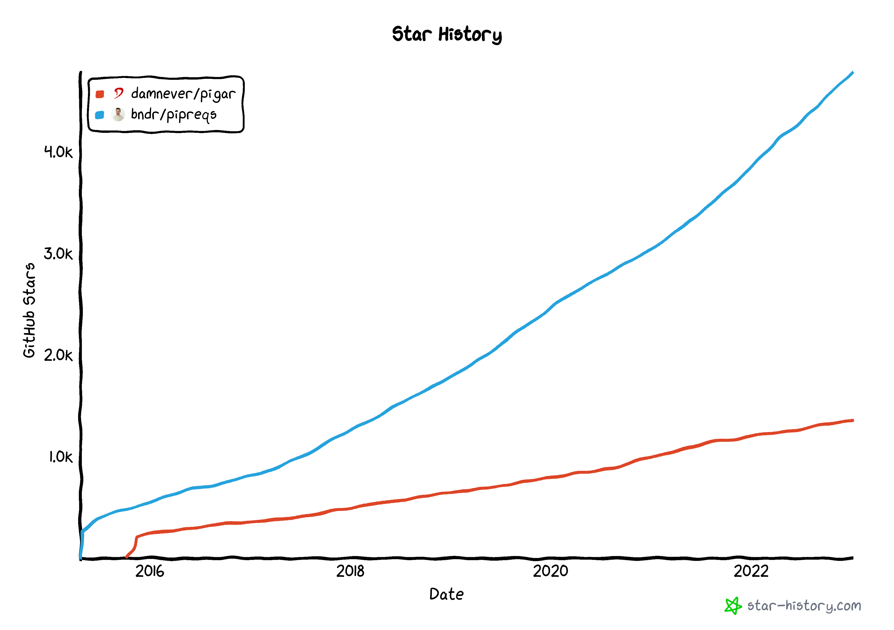

# FawltyDeps

## A dependency checker for Python

## Design document

Authors: [Nour el Mawass](mailto:nour.elmawass@tweag.io), [Maria Knorps](mailto:maria.knorps@tweag.io)

Created: 12 Nov. 2022

## 1. Introduction

In Python, required packages (dependencies) are declared separately from their usage (imports within the code). There is no straightforward way to check if all imports in the code are declared as dependencies.

It is a common problem that import statements refer to packages that were installed manually on the programmer’s computer without being explicitly added to the requirements list.

Whether it’s a personal library, an application to be deployed, or a library that will be distributed for others to use, making sure that a project’s imported packages are all declared as dependencies is vital for the correct packaging of that project. This will ensure both, reproducibility in other build environments and usability by other prospective users.

This document will walk the reader through the different intricacies of Python packaging, and propose a simple modular solution to the non-declared dependencies problems. Many of the terms thrown around (such as “library”, “package”, and “dependency”) are overloaded, so we make sure we define and contrast each of those.

To the best of our knowledge, there does not currently exist a solution that would effectively check if a project’s declared dependencies match its imported libraries. Different aspects of the problem (e.g. extracting imported packages from Python files, generating a list of requirements, parsing transitive dependencies, validating dependencies’ versions compatibility) have been explored by other contributors. We describe existing libraries and approaches, and where relevant, we indicate those that we adopted or used.

For our prototype, we propose a command line tool. Given a Python project, this tool returns a list of unmatched imports and dependencies. A command line tool is versatile and adapted to the different usage scenarios described below. It can be both part of a manual development process or automated verification.

A later iteration of the project could explore how to boost the usability and visibility of the implemented tool by:

- Wrapping it as a GitHub CI action
- Including it in an existing Python Linter
- Developing a VS code / Emacs extension

It has been indicated to us by a couple of Tweag engineers (e.g. Daniel Baker) that this could be a useful tool for Python Nix packaging. We have yet to explore how that could be the case.

### Scope and requirements

This project’s goal is to check whether a Python project has declared all the dependencies its code is importing.

The check has different levels of assurance: a name match, package existence and package match. Proof-of-concept of FawltyDeps will address the first two.

It is outside the scope of this work to:

- Automatically generate requirements file (as in `pipreqs` and `pigar`).
- Check that a solution to the declared requirements version exists (as poetry does).
- Complete a list of declared dependencies with transitive dependencies (as in `pip-compile`).
- Check that a declared dependency is the one that should be used (exposes not only modules, but particular functions and objects used).

Despite initially wanting this to be a stateless checker, the intricacies of Python packaging make it impossible to verify if the dependencies are declared without gathering information from beyond the project’s code base (be it the project’s local environment or PyPI or GitHub repositories). The state of information in these repositories may evolve over time.

The checker will output an error if an import does not correspond to a declared dependency (and a warning if a dependency is declared but unused).

The remainder of this document is organized as follows. Section 2 motivates the need for the FawltyDeps library and possible usage of the library through use cases and user personas. Section 3 provides a background on the Python’s imports ecosystem and may be skipped and consulted on a per-need basis. Solutions are presented, compared and contrasted in section 4. The landscape of existing work is charted in section 5 and existing contributions are compared to what FawltyDeps is attempting to achieve. Future work and enhancements are discussed in section 6.

## 2. Motivation and usage

There are 2 main use cases where it is useful to check that declared dependencies are complete. Both cases involve a need to run a library in an environment different from the one it was developed in. The first case is an application that needs to be deployed in a reproducible manner. The second is a library shared with other users that also needs to be usable in different environments and in different settings.

Expanding from this initial motivation, we present below different user personas and use cases that would benefit from using a dependency checker.

### 2.1 User personas

- **Annie Black**

  _Occupation_: Data Scientist \
   _Goal_: Share her Jupyter notebook on GitHub (with a `requirements.txt` file) for other people to use.\
   _Frustrations_: Non-repeatable project setup with missing dependencies.

- **Jason Blue**

  _Occupation_: Computer science student \
   _Goal_: Publish the Python library he implemented on PyPI.\
   _Frustrations_: Users complain about missing imports when installing the library.

- **Patrick Magenta**

  _Occupation_: Computational biologist \
   _Goal_: Contribute to an open-source project.\
   _Frustrations_: Non-repeatable project setup with missing dependencies.

- **Deborah Yellow**

  _Occupation_: Data engineer \
   _Goal_: Productionize ML pipelines developed by data scientists.\
   _Frustrations_: CI failing on missing dependencies.

- **Andrew Cyan**

  _Occupation_: Nix developer \
   _Goal_: Package python dependencies.\
   _Frustrations_: Inability to build package due to dependencies missing in expected files (pyproject.toml, requirements.txt, setup.py).

- **Francis White**

  _Occupation_: Software developer’s experience engineer \
   _Goal_: Improve developers' productivity.\
   _Frustrations_: Developers waste time on finding errors in CI.

## 2.2 User stories

- Deborah wants to rerun another developer’s package. She would like to know if all dependencies are in place before she sends it to time-consumingCI.
- Patrick installed [Hail](https://hail.is/), which installs `requests` as a dependency. When he wrote a REST API, he forgot to add `requests` to his `requirements.txt`. The code ran correctly, but an explicit declaration of the dependency was lacking until Andrew pointed it out. Patrick would like to find those problems automatically.
- Andrew recently added [testbook](https://github.com/nteract/testbook/) to `nixpkgs` and the `requirements.txt` file only listed two dependencies. When he tried to build it, there were four additional dependencies needed to run the tests. He would like all his dependencies explicitly declared.
- Francis observed that developers were using `pandas` installation from the Python packages located systemwide in Ubuntu. When the other team started working on the code, they had tests failing due to the lack of `pandas` library. Francis would like to automate checks of missing dependencies to ensure a smooth transfer of projects between teams.
- Francis observed that multiple times in the last week developers were using `numpy` in the code, but did not explicitly state this in requirements, as `pandas` installs `numpy` anyway. This led to multiple problems with the `numpy` version, which did not support some newly used features. Francis would like to have a reproducible and explicit environment declaration.
- Annie reran her package in a different environment and had to fill in missing packages signaled by import errors. Annie would like to catch problems with missing dependencies earlier and get a list of all missing packages in one run.

## 3. Background

This section provides the technical background needed to understand the Python imports and dependencies system. Reading it is recommended but is not required to understand the proposed solution. You can therefore skip to Section 4 and come back to this section if needed.

To avoid confusion and term overloading, let us start by defining some key terms. We will use the example of the `google_api_python_client `library on PyPI. This library exposes multiple packages (`“apiclient", "googleapiclient","googleapiclient/discovery_cache"`), which can be imported in the Python code.

- **A package** is a collection of Python modules, having an `__init.py__` file.

- **A library** exposes one or more packages (as defined in the packages field in setup.py or pyproject.toml, e.g. `google_api_python_client` exposes `"apiclient", "googleapiclient", "googleapiclient/discovery_cache"`. A library is commonly installed from PyPI.

- **Import name** is the name used to import the package in the Python source code (e.g. `import googleapiclient`).

- **Dependency name** is the name of the distributed library (e.g. `google_api_python_client`).

- **Declared dependency** is any library that is declared to be used by your code as per the methods outlined in section 3.3.

- **Direct dependency** is any external library that exposes a package that is needed as a direct result of an `import` in your code. A direct dependency that is not declared (as outlined in section 3.3) is considered an error by FawltyDeps (i.e. this is the primary thing FawltyDeps is looking for.)

- **Transitive (indirect) dependency** is a dependency of your dependency. This is any external library that must be available for your code to function correctly. A dependency can be both direct and transitive (e.g. your code can `import numpy` and also `import pandas`, which itself depends on `numpy`). In these cases the concerns of a direct dependency are more important (e.g. you should always declare a direct dependency even if it also happens to be an indirect dependency).

### 3.1 Parsing imports

In the Python source code, modules may be imported in different places of the code. While it’s good practice to follow [PEP-8](https://peps.python.org/pep-0008/#imports) suggestions, the Python code we are to check may not be following those rules. Imports may be placed inside functions and classes.
Python source code files usually have the `.py` extension. Other commonly used file types are jupyter notebooks, using `.ipynb`[^1].

#### Types of imports

There are four ways to import a Python module as per the import system [documentation](https://docs.python.org/3/reference/import.html#the-import-system):

- Absolute imports: <code><strong>from</strong> packageX <strong>import</strong> Y</code>
- Standard imports: <code><strong>import </strong>packageX</code>
- Aliases for imports: <code><strong>import</strong> packageX <strong>as</strong> PX, <strong>from</strong> packageX <strong>import</strong> Y <strong>as</strong> X</code>
- Function calls: <code>[importlib.import_module()](https://docs.python.org/3/library/importlib.html#importlib.import_module)</code> and built-in <code>[\_\_import\_\_()](https://docs.python.org/3/library/functions.html#import__)</code>.

Imported packages may be either absolute or [relative](https://docs.python.org/3/reference/import.html#package-relative-imports). The latter refers to the current package and starts with a leading dot, like <code><strong>from</strong> .packageX <strong>import</strong> Y.</code>

#### Detecting imports in a Python module

The structure of a Python source code file can be easily obtained via the standard library [Abstract Syntax Trees](https://docs.python.org/3.10/library/ast.html) module. The AST library also provides an efficient way to traverse trees. Combined with standard filtering, only “leaves” representing imports are returned.

Imports fall into one of four nodes in the AST (respective to a type of import):

- Absolute imports: `ast.Import`
- Standard imports: `ast.ImportFrom`
- Aliases for imports: `ast.alias`
- Function call: `ast.Expr` with a call to either `__import__` or <code>import_module</code> function from <code>importlib</code>

Interpreting function calls as imports is not straightforward. They may use module names from other variables, functions, and external data.

### 3.2 Translating imports to dependencies

Imports do not always have the same names as the dependencies they originated from. Given an argument of an import statement, Python searches for dependencies in steps[^2].

First, it checks in `sys.modules` - a dictionary that maps Python module names to modules that have already been loaded into the environment. If the named module is not found in `sys.modules`, then Python’s import protocol is invoked to find and load the module: `sys.meta_path`. This involves the usage of Python’s `sys` Finders and Loaders, which may be implemented with separate strategies. For FawltyDeps, we are only concerned with “finders”[^3].

For a project that correctly runs on a local environment, it’s possible to translate imports to dependencies the same way Python does, i.e. by using the “finder” strategy. It is, for example, possible to follow the `*.dist-info/` directory of the library and to look at the `top_level.txt` file for exposed packages and at `METADATA` for the library name.

In an arbitrary project, however, translating imports gathered from the source code to dependencies is a hard problem for several reasons:

1. Not all libraries have the same name as the packages they expose (`pandas` exposes `pandas`, but `google_api_python_client` exposes `["apiclient", "googleapiclient", "googleapiclient/discovery_cache"]`).
2. Different libraries may provide import names (modules or packages) that overlap. For example, the 'google' import name may be obtained from different libraries, including `['google-api-core', 'googleapis-common-protos', 'protobuf', 'google-auth']`. This can complicate finding the appropriate library for a given import name.`.`
3. PyPI does not provide an API with a list of top-level packages given by the library.
4. Top-level packages of a library may not be declared explicitly, but could instead be using [package discovery](https://setuptools.pypa.io/en/latest/userguide/package_discovery.html#custom-discovery) (for projects using `setuptools`).

Since PyPI does not readily provide this information, some libraries have attempted to solve the problem of translating imports to dependencies through a static mapping between PyPI libraries and the packages they expose (a csv file in [pipreq](https://github.com/bndr/pipreqs) and a database in [pigar](https://github.com/damnever/pigar)). These are shipped with the code and are not updated. This approach is discussed in more detail in the proposed solution section.

### 3.3 Extracting a package’s declared dependencies

#### 3.3.1 Declaring dependencies

Historically, [distutils](https://docs.python.org/3/library/distutils.html#module-distutils) was used to ship a Python package[^4]. Now [setuptools is the most](https://setuptools.pypa.io/en/latest/) common way to build a distribution package. There are other tools, like [PyInstaller](https://pyinstaller.org/en/stable/operating-mode.html#) that builds a project into a single folder or file with all locally installed dependencies shipped with it. This is not a use case for FawltyDeps. Packing a project with explicitly given dependencies, like with setuptools, gives the flexibility to manage and update dependencies separately. Due to security updates of packages and the sheer size of a more complex project, this is the usual approach.

Dependencies of a Python project may be declared in [requirements](https://pip.pypa.io/en/stable/reference/requirements-file-format/#requirements-file-format) (usually `requirements.txt`, but a name choice is not restricted), `setup.py`, `setup.cfg`, and then <code>[pyproject.toml](https://peps.python.org/pep-0518/)</code> (since PEP 518). Setup files - setup.py and setup.cfg declare dependencies under the <code>\*\_requires</code> keywords and pyproject.toml lists dependencies under <code>dependencies</code>.

#### 3.3.2 Extracting dependencies

While a requirements file only lists the dependencies of a project (with eventual constraints), setup files and pyproject.toml declare other packaging configuration as well. It is possible to e.g. translate pyproject.toml dependencies to requirements using [poetry](https://github.com/python-poetry/poetry-plugin-export). A dependency format converter may be useful for both setup and pyproject.toml files.

Requirements files may have non-standard names so to extract dependencies FawltyDeps must have the option to give a list of requirements files.

### 3.4 Extracting transitive dependencies

Some Python packages require other packages to be installed first (like numpy for pandas). We call them transitive dependencies. When a transitive dependency A is imported explicitly in the code, it becomes a direct dependency. That is why, even though the code would work without explicitly declaring A, it is a better practice to do so.

To determine the list of transitive dependencies of a library `myLibrary`, the pip command:

    pip show myLibrary

may be used or the `poetry show` command.

Since a transitive dependency does not need to be explicitly declared, checking for transitive dependencies should be optional.

### 3.5 Translating dependencies to imports

Given a dependency, by downloading (e.g. from PyPI) and unpacking the corresponding library, it’s possible to obtain the import names from the `top_level.txt` file.

## 4. Proposed solution

### 4.1. Solution outline

At a first glance, the solution might look trivial once a set of imports (from the Python code) and a set of dependencies (from the packaging information) are obtained. The solution then reduces to comparing these two sets, making sure that dependencies form a superset of imports.

While this might initially seem like a sufficient approach, directly comparing these two sets is not enough for the following reason:

1. An import name is not guaranteed to be exactly equivalent to the corresponding dependency name (e.g. `library google-api-python-client` exposes package `apiclient`).
2. The same library may expose different packages, which then correspond to different import names (e.g. `library google-api-python-client` apart from `apiclient `exposes `googleapiclient` and `googleapiclient/discovery_cache`).

In other words, given two one-element sets of imports and dependencies, {`apiclient`} and {`google-api-python-client`} respectively, originating from the same Python project, there’s no static way to compare these sets.

This is further complicated by the following observations:

1. The same import name can map to various library names representing different packages (e.g. on PyPI, both `retina-face` and `retinaface` have the same import name `retinaface`). The import-to-dependency relation is one-to-many.
2. Some imports might not have their corresponding dependencies explicitly declared because they are transitive dependencies (e.g. numpy is a prerequisite of pandas).

The analysis above shows that these sets should be mapped to the same domain before a comparison is possible. One possible mapping would be to map one set to the domain of the other, i.e. map import names to dependency names or vice versa.

The solution would then consist of 4 main modules (see the diagram below):

1. Extract imports used in the code.
2. Extract declared dependencies.
3. Map imports and dependencies to the same domain.
4. Compare mapped imports and dependencies.

[1] Solution diagram; [link](https://lucid.app/lucidchart/77d4a86d-e78c-460c-9d25-4e1875ca18f6/edit?viewport_loc=119%2C391%2C952%2C562%2C0_0&invitationId=inv_901446c1-61e2-4362-be64-3a6e94975859).

### 4.2. Possible domain mappings

We discuss in this section, three possible imports and dependencies mappings, differing in complexity and having each its advantages and limitations:

1. Identity mapping.
2. Mapping import names to library names.
3. Mapping library names to import names.

### 4.2.1 Identity mapping

As the name implies, this assumes import names are equivalent to library names. It allows for static checking, and compared to the more complex mappings detailed below, is exceedingly straightforward.

Despite lacking empirical evidence on how many libraries (e.g. on PyPI) use the library name as an import name, we expect this mapping to be useful as a lightweight check that covers the majority of libraries.

The major limitation of the identity mapping strategy is that it cannot compare an import x to a dependency y if those are not identically named. Therefore, the moment the imports set and the dependencies set differ, we would need to map one set to the domain of the other.

Furthermore, even when the sets are identical, there is no guarantee that dependencies are correctly declared. As we have discussed earlier, an import x does not necessarily map to a dependency x. It is possible to go one step further and check that the declared dependencies exist (on e.g. PyPI).

While this would probably guard against declaring non-existent libraries, it would still not solve the following situation (as no mapping between the import and dependency domains is performed). Suppose you use `import madeup` in your code, and you assume the dependency name to be `madeup` as well so that’s what you provide in `requirements.txt`. As it turns out, `madeup`, the dependency, exists, but does not expose a package `madeup`. What you needed to declare was `pymadeup`, which effectively exposes import name `madeup`. The checker would not flag the dependency as missing, since no mapping has been done and it was assumed the dependency is indeed the one declared.

An extension to this is relaxed equality[^5], where punctuation and conversions between snake_case and kebab-case are allowed. This is a cheap extension (no package downloading and unpacking is required) that can extend the usability of identity mapping.

#### 4.2.2 Import to dependency mapping

Mapping an import name to a dependency name is based on the premise that it would be easy to map an import (module or package) to a dependency (library).

Suppose you have the import `madeup` and that you’d like to find the corresponding library name. This is often done via search engines and manual inspection of matching results.

To simplify the problem, let’s further suppose that this is a PyPI library. One would expect that PyPI has a mapping from import names (which are essentially names of packages exposed by a library) to a library name. This is unfortunately not a valid assumption as such a mapping does not exist.

PyPI offers some features that can be exploited to construct the mapping in an offline or online manner. There’s the search feature, which is a free text search on the information publicly available on the library’s PyPI web page. The library information available via the metadata API does not contain the exposed package's information (import names). Thus the only way to obtain that information seems to be by downloading and unpacking the library from PyPI.

Note that in both cases, the mapping is limited to libraries available on PyPI and would not be able to map an import to a non-PyPI library.

Furthermore, the check would now become a verification that for every import, the intersection between the mapping of that import to the dependency space and the declared dependencies is non empty..

_Offline mapping_

One could imagine iterating through all libraries in PyPI, and for each library, downloading, unpacking, and extracting the list of package names. Once a database is constructed, this would allow instant mapping from the package name to the library name (and vice versa). But this solution has two main limitations. First, the constructed database would need to be shipped with the code or available via an API, which adds either a heavy file or the need to communicate with an external service. Second, periodic maintenance and updates for the database are needed so it does not become stale.

_Online mapping_

The closest one could get to finding a package (i.e. import) name in PyPI is via its free text search. As stated above, this search is not done over the structured library information but over the information available on the PyPI web page of the library. As this search would understandably return many unrelated results, post-processing on these results is needed. This would consist of downloading and unpacking each library to extract the packages' names. While this might seem like an improvement over the whole PyPI mapping described above, keep in mind that some search terms (e.g. google) may return tens of thousands of records.

A limitation is that the import name is not guaranteed to be on the library’s web page so the search might not return the wanted library.

Another potential downside is that it's not uncommon to run CI in a heavily restricted network environment (e.g. using a URL allowlist). Getting such allow lists updated can, in some organizations, be pretty arduous. As such, the ability to run FawltyDeps entirely offline will likely lower the barrier to entry significantly.

_Conclusion_

Static offline mapping has been done in libraries such as pipreqs and pigar, and is usually distributed with the library. As previously stated, this has the disadvantage of leading to stale mappings. A possible solution is to provide an API offering a frequently updated version of that PyPI mapping. This in itself would be a useful contribution and could be used by libraries attempting to automatically generate a project’s requirements. It is, however, an instance of solving problem B (mapping import names to dependency names) in order to solve problem A (ensuring all imports are declared). And, as we show in the next section, might be rendered unnecessary by mapping in the opposite direction.

Another possible way to limit the scope of the mapping is when all dependencies are installed in the local environment in which FawltyDeps would run. The checker can, in this case, search locally installed libraries in order to create the needed mapping. A similar solution is provided as an option in `pipreqs`.

### 4.2.3 Dependency to import mapping

The previous section focused on mapping imports to dependencies. That can be a useful exercise if the goal is to automatically generate a Python project’s dependencies (e.g. the requirements.txt file). The goal of this project however is to check if the declared dependencies match the used imports.

Mapping dependencies to imports is conceptually more aligned with that goal. And while that can still be easily reconstructed from any full PyPI import to dependency mapping, having a full mapping is unnecessary. Given a set of dependencies, by downloading and unpacking each library, as described in the previous section, it’s possible to obtain the import names (from e.g the top-level or the dist-info directories) in an on-demand fashion. Only dependencies declared in the project are downloaded and unpacked. The test would then become to verify that the mapped dependencies form a superset of extracted imports.

This solution has the advantage of not being limited to PyPI libraries. Like the online mapping discussed above, however, it also requires access to the repositories of the project’s dependencies (e.g. PyPI, Github, ..)

As in the previous solution, it is equally possible to limit this solution to searching in the local environment. This can also be made the default option, after which the tool would expand the search to public repositories.

# 5. Related work

## 5.1 Linters

A perfect place to have a dependency checker add-on would be linter. The most popular: `flake8` and `pylint` do not provide this functionality.

## 5.2 Translating imports to requirement.txt

Several libraries generate requirements based on imports in Python source code. The two most visible in the community are [pipreqs](https://github.com/bndr/pipreqs) and [pigar](https://github.com/damnever/pigar). In the context of Python Dependency Checker, they cover parsing imports and mapping them to PyPI libraries.

`pipreqs` is more popular than `pigar`, as can be seen in the Github star history graph [2], but it has not been regularly maintained for the last year and a half. It currently has many open and unsolved issues. `pipreqs` is also much simpler than pigar in terms of source code and functionality.

[2] History of GitHub stars of pigar and pipreqs libraries

\
Both libraries use AST to inspect Python source code, but `pigar`’s implementation is more robust. `pipreqs` parses the simplest imports only (the ones that can be found in AST under `Import` or `ImportFrom` class) while `pigar` parses `exec`, `importlib` expressions, and more.

Both libraries rely on a mapping of PyPI libraries to exposed packages. In `pipreqs`, this is done with a CSV file, which is seldom updated lately. In `pigar`, the mapping is more elaborate - it consists of an SQLite database and an additional PyPI package check, performed when the `pigar` script is run to generate the requirements.txt file (in case there was a breaking change between versions or a package was deleted). To check a package, pigar downloads it from PyPI in a packed form and peeks at the top_level.txt file to see the list of exposed packages. To assign a package version, pipreqs checks if a library is installed locally, and if so, it uses the version from the metadata of installation. If not, then it infers the library name from a static file mapping and posts a request to PyPI with that library name to get a package version.

Import parsing is done well in `pigar`, and our library can take inspiration from that. The import to dependencies translation (generating requirements.txt) depends on the chosen solution. Pigar downloads all possible candidates for a dependency package and it is a time-consuming process. Neither of the discussed libraries has a caching mechanism.

### 5.3 Dependency management libraries

Both [Poetry](https://python-poetry.org/) and [pip-tools](https://github.com/jazzband/pip-tools) are package management libraries that offer complimentary features to what FawltyDeps proposes to achieve. We discuss below Poetry’s functionality in more details.

[Poetry](https://python-poetry.org/) is a popular dependency management and packaging library for Python. Its features are centered around:

- the pyproject.toml file, in which custom Poetry fields are defined.
- a corresponding poetry.lock file which “locks” versions of the project’s dependencies to ensure reproducibility.

Poetry manages installation of packages and offers its own virtual environments. It has a dependency specification syntax coupled with a powerful dependency resolving mechanism. It can “sync” an environment with declared dependencies to ensure that no extra libraries are installed, which can prevent using a library in the development environment without proper declaration.

While Poetry has a `check` command, this command only validates the structure of the pyproject.toml file, and does not ensure that all the imported dependencies are declared. Poetry seems to limit itself to the scope of defining and managing dependencies and doesn’t in fact seem to do any code introspection.

Poetry commands and our proposed tool’s functionality complement each other, and it’s possible to consider having FawltyDeps as a Poetry plugin in the future.

## 6. Future work

- Ensuring from the usage of the library in the code that the declared library is the needed one.
- Transitive dependencies:
  - Completing requirements.txt with used but undeclared transitive dependencies.
  - Downgrading the error on a missing transitive dependency to a warning (e.g. x is a dependency of declared library y but is not explicitly declared).
- Execution time
  - Implement caching mechanism.
  - Smart mapping (identity, then translation)

## References

### Python documentation

1. PEP 8 – Style Guide for Python Code: [https://peps.python.org/pep-0008/#imports](https://peps.python.org/pep-0008/#imports).
2. The import system: [https://docs.python.org/3/reference/import.html#the-import-system](https://docs.python.org/3/reference/import.html#the-import-system).
3. Abstract syntax tree: [https://docs.python.org/3.10/library/ast.html](https://docs.python.org/3.10/library/ast.html).
4. Distutils: [https://docs.python.org/3/library/distutils.html#module-distutils](https://docs.python.org/3/library/distutils.html#module-distutils).
5. PIP: [https://pip.pypa.io/en/stable/reference/requirements-file-format/#requirements-file-format](https://pip.pypa.io/en/stable/reference/requirements-file-format/#requirements-file-format).
6. PEP 518 - Specifying Minimum Build System Requirements for Python Projects: [https://peps.python.org/pep-0518](https://peps.python.org/pep-0518).

### Libraries

1. Testbook is a unit testing framework extension for testing code in Jupyter Notebooks: [https://github.com/nteract/testbook/](https://github.com/nteract/testbook/).
2. Hail, cloud-native genomic data frames, and batch computing: [https://hail.is/](https://hail.is/).
3. Nbconverter converts notebooks to other formats: [https://nbconvert.readthedocs.io/en/latest/](https://nbconvert.readthedocs.io/en/latest/).
4. SetupTools, packaging Python projects: [https://setuptools.pypa.io/en/latest/](https://setuptools.pypa.io/en/latest/).
5. Pireqs, generate requirements.txt based on imports: [https://github.com/bndr/pipreqs](https://github.com/bndr/pipreqs).
6. Pigar, generate requirements.txt based on imports: [https://github.com/damnever/pigar](https://github.com/damnever/pigar).
7. PyInstaller, angle folder static Python packaging: [https://pyinstaller.org/en/stable/operating-mode.html#](https://pyinstaller.org/en/stable/operating-mode.html#).
8. Poetry, Python packaging, and dependency management:[ https://python-poetry.org/](https://python-poetry.org/).
9. Poetry, a plugin to export locked packages: [https://github.com/python-poetry/poetry-plugin-export](https://github.com/python-poetry/poetry-plugin-export).
10. Pip-tools, a set of command-line tools to maintain pip-based packages: [https://github.com/jazzband/pip-tools](https://github.com/jazzband/pip-tools).

### Other sources

1. Caremad.io, a blog post about setup.py and requirements.txt: [setup.py vs requirements.txt · caremad](https://caremad.io/posts/2013/07/setup-vs-requirement/).
2. Towardsdatascience.com, a blog post about setup.py and requirements.txt: [requirements.txt vs setup.py in Python](https://towardsdatascience.com/requirements-vs-setuptools-python-ae3ee66e28af).

<!-- Footnotes themselves at the bottom. -->

### Notes

[^1]: Notebooks may be converted to Python script with <code>[nbconvert](https://nbconvert.readthedocs.io/en/latest/)</code> - command line tool and library.
[^2]: See the import paths search [Python documentation](https://docs.python.org/3/reference/import.html#searching).
[^3]: See an [example](https://docs.python.org/3/library/modulefinder.html#modulefinder-example) of usage of Python’s ModuleFinder.
[^4]: distutils is deprecated and will be removed in Python 3.12.
[^5]: Suggested by [Thomas Bagrel](thomas.bagrel@tweag.io).
