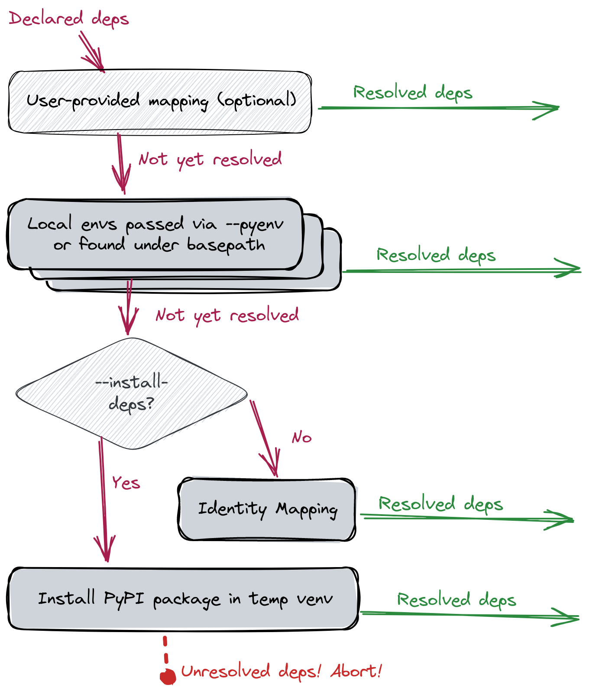

## Key Concepts

- **_undeclared_ dependency**:
  a package that's used (in particular, `import`ed) by a project and which lacks a corresponding declaration to ensure that it's available.
  For example, you `import numpy`, but you've forgotten to include `numpy` in your `requirements.txt`.
  Pragmatically, this means the project is prone to runtime errors.
- **_unused_ dependency**:
  a package that's declared as necessary for a project but which is never used by project code.
  For example, you have `numpy` listed in your `requirements.txt`, but you never actually `import numpy`.
  Pragmatically, this means that project installation may consume more space than needed and will be more likely to break with future software releases; in short, these are costs paid for no benefit.

## Resolving dependencies

When FawltyDeps looks for undeclared and unused dependencies, it needs to match
`import` statements in your code with corresponding package dependencies
declared in your project configuration.

To solve this, FawltyDeps uses a sequence of resolvers (aka. mapping strategies)
to determine which Python packages provide which import names. For more details,
check the [FawltyDeps mapping strategy blog post](https://www.tweag.io/blog/2023-09-21-fawltydeps-mapping-strategy/). The diagram below
shows the dependencies' flow through the sequence of mappings supported by
FawltyDeps (each of which is introduced in the following subsections):

- Local Python environment mapping
- Mapping via temporarily installed packages
- Identity mapping
- User-defined mapping



The priority of each of these mappings, together with their default values and
customization options are summarized in the table below:

| Priority | Mapping strategy                                     | Options                                                                                                                                                                    |
| -------- | ---------------------------------------------------- | -------------------------------------------------------------------------------------------------------------------------------------------------------------------------- |
| 1        | User-defined mapping                                 | Provide a custom mapping in TOML format via `--custom-mapping-file` or a `[tool.fawltydeps.custom_mapping]` section in `pyproject.toml`. <br /> Default: No custom mapping |
| 2        | Mapping from installed packages found inside project | Point to one or more environments with `--pyenv`.<br />Default: auto-discovery of Python environments under the project’s basepath.                                        |
| 3        | Mapping from packages installed in `sys.path`        | Active by default. No CLI option. This finds packages installed in the Python environment in which FawltyDeps itself runs.                                                 |
| 4a       | Mapping via temporary installation of packages       | Activated with the `--install-deps` option.                                                                                                                                |
| 4b       | Identity mapping                                     | Active by default. Deactivated when `--install-deps` is used.                                                                                                              |

### Local Python environment mapping

Local Python environment mapping refers to using packages already installed
in local Python environments on your system to resolve dependencies into
the imports they expose. This leverages the functionality provided
by the excellent [`importlib_metadata`](https://importlib-metadata.readthedocs.io/en/latest/)
library.

You can use the `--pyenv` option (or the `pyenvs` configuration directive)
to point FawltyDeps at one [or more] specific Python environment(s) located
within your project or elsewhere. For example:

```sh
fawltydeps --code my_package/ --deps pyproject.toml --pyenv /path/to/project/venv
```

This will tell FawltyDeps:

- to look for `import` statements in the `my_package/` directory,
- to parse dependencies from `pyprojects.toml`, and
- to use the Python environment at `/path/to/project/venv` to map dependency names in
  `pyproject.toml` into import names used in your code under `my_package/`

If `--pyenv` is not used, FawltyDeps will look for _Python environments_
(virtualenvs or similar directories like `.venv` or `__pypackages__`.) inside
your project (i.e. under `basepath`, if given, or the current directory).

You can use `--pyenv` multiple times to have FawltyDeps look for packages in
multiple Python environments. In this case (or when multiple Python environments
are found inside your project) FawltyDeps will use the union (superset) of all
imports provided by all matching packages across those Python environments as
valid import names for that dependency.

### Current Python environment

In addition to the local Python environments found above, FawltyDeps will also
look at your _current Python environment_, i.e. the environment in which
FawltyDeps itself is installed. This works well when you, for example,
`pip install fawltydeps` into the same virtualenv as your project dependencies,
no matter where this virtualenv may be located.

### Identity mapping

When unable to find an installed package that corresponds to a declared
dependency either via a [user-defined mapping](#user-defined-mapping) or local 
Python environments, FawltyDeps will fall back to one of two strategies.
"Identity mapping", which we present in this section is the default fallback
strategy. We discuss the other strategy in the next subsection.

Identity mapping relies on the simplistic assumption that the dependency provides
a single import of the same name, i.e. it will expect that when you depend on
`some_package`, then that should correspond to `import some_package` statements
in your code.

This assumption is correct for many packages and it allows FawltyDeps to
produce results (albeit sometimes inaccurate ones) when the current Python
environment does not contain all of your declared dependencies.

To ensure correctness, however, refer to the next subsection outlining the other
fallback strategy.

### Mapping by temporarily installing packages

Your local Python environments might not always have all your project's
dependencies installed. Assuming that you don’t want to go through the
bother of installing packages manually, and you also don't want to rely on
the inaccurate identity mapping as your fallback strategy, you can use the
`--install-deps` option. This will automatically install missing dependencies
(from [PyPI](https://pypi.org/), by default) into a _temporary virtualenv_,
and allow FawltyDeps to use this to come up with the correct mapping.

Since this is a potentially expensive strategy (e.g. downloading packages from
PyPI), we have chosen to hide it behind the `--install-deps` command-line
option. If you want to always enable this option, you can set the corresponding
`install_deps` configuration variable to `true` in the `[tool.fawltydeps]`
section of your `pyproject.toml`.

FawltyDeps will use [`uv`](https://github.com/astral-sh/uv) by default to
temporarily install missing dependencies. If `uv` not available, `pip` will be
used instead. If you want to ensure that the faster `uv` is available, you can
install `fawltydeps` with the `uv` extra (e.g. `pip install fawltydeps[uv]`).

To further customize how this automatic installation is done (e.g. if you need
to use a different package index), you can use environment variables to alter
[`uv`'s](https://github.com/astral-sh/uv?tab=readme-ov-file#environment-variables)
or [`pip`’s ](https://pip.pypa.io/en/stable/topics/configuration/) behavior.

Note that we’re never guaranteed to be able to resolve _all_ dependencies with
this method: For example, there could be a typo in your `requirements.txt` that
means a dependency will _never_ be found on PyPI, or there could be other
circumstances (e.g. network issues or restrictions in your CI environment) that
prevent this strategy from working at all.
In this case, FawltyDeps will throw an error and abort.

### User-defined mapping

Sometimes Python dependencies are imported using a different name than the package
name used in the `import` statement. Some Python packages might have hyphens in
their dependency names used by package managers, but underscores in their import 
names, for example.

We provide a custom mapping functionality to users wishing to take control
over the way FawltyDeps resolves dependencies. You may define your own mapping
of dependency names to import names, by providing a TOML file like this:

```toml
langchain-core = ["langchain_core"]
multiple-modules = ["module1", "module2"]
my-package = ["mpkg"]
python-dotenv = ["dotenv"]
scikit-learn = ["sklearn"]
```

The package name of the dependency is on the left-hand side of the `=`, and the
import name(s) are on the right-hand side. You can provide multiple import names
for a single dependency.


To use your mapping, run:

```sh
fawltydeps --custom-mapping-file my_mapping.toml
```

FawltyDeps will parse your `my_mapping.toml` file and use the extracted mapping
for matching dependencies to imports.

You may also place the custom mapping in the `pyproject.toml` file of your
project, inside a `[tool.fawltydeps.custom_mapping]` section, like this:

```toml
[tool.fawltydeps.custom_mapping]
langchain-core = ["langchain_core"]
multiple-modules = ["module1", "module2"]
my-package = ["mpkg"]
python-dotenv = ["dotenv"]
scikit-learn = ["sklearn"]
```

The provided mapping can be complete or partial. When a dependency is not
present in the given mapping, FawltyDeps will continue to resolve it using
the sequence of resolvers illustrated in the diagram above.

Caution when using your mapping is advised: As illustrated in the diagram, the
user-defined mapping takes precedence over the other resolvers documented
above. For example, if the mapping file has some stale/incorrect mapping
entries, they will _not_ be resolved by the Python environment resolver (which
is usually more accurate).
